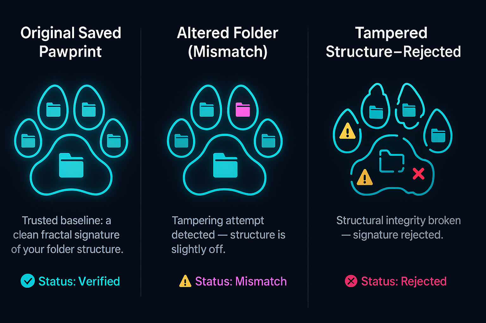

# Pawprinting PyQt6 V2 Application

A powerful digital pawprinting tool built with PyQt6 for improved native macOS integration with advanced automation capabilities.

## Overview

This application is the V2 release of the Pawprinting PyQt6 application with enhanced features for generating and analyzing digital pawprints from various data sources. It builds upon the success of the V1 release, adding improved file comparison features and UI refinements.

## Features

- **Native macOS Integration**: Uses PyQt6 for a truly native macOS experience
- **Dark Mode Support**: Automatically detects and applies the system theme
- **Improved File Dialogs**: Native file selection with recent directories support
- **Enhanced Console Output**: Rich text console with ANSI color support and timestamps
- **Robust Progress Tracking**: Detailed progress tracking with ETA calculation
- **Fractal-Butterfly Analysis**: Advanced fractal pattern analysis capabilities
- **Comprehensive Logging**: Detailed logging with file output
- **File Comparison**: Advanced pawprint comparison with detailed similarity metrics
- **HTML Report Export**: Rich, color-coded comparison reports with detailed analysis
- **Desktop Launcher**: Easy-to-use desktop shortcut for quick application startup
- **Modular Automation System**: Flexible task scheduling and execution framework
- **Pawprint History Management**: Track and manage previously analyzed folders
- **Batch Pawprint Processing**: Refresh pawprints for multiple folders in one operation
- **CLI Automation Interface**: Command-line tools for scripting and automation

## Installation

### Prerequisites

- Python 3.9+
- macOS (tested on macOS Monterey and later)

### Setup

1. Clone the repository:
   ```bash
   git clone <repository-url>
   cd Pawprinting_PyQt6
   ```

2. Create a virtual environment:
   ```bash
   python3 -m venv venv_pawprinting_pyqt6
   source venv_pawprinting_pyqt6/bin/activate
   ```

3. Install the required packages:
   ```bash
   pip3 install -r requirements.txt
   ```

## Usage

### Running the Application

```bash
source venv_pawprinting_pyqt6/bin/activate
python3 pawprint_pyqt6_main.py
```

For convenience, you can create an alias:

```bash
alias pawprint_pyqt6='cd /path/to/Pawprinting_PyQt6 && source venv_pawprinting_pyqt6/bin/activate && python3 pawprint_pyqt6_main.py'
```

### Generating a Pawprint

1. Launch the application
2. Click "Generate Pawprint" on the dashboard
3. Select a source folder or file containing the data to analyze
4. Configure generation options
5. Click "Generate Pawprint"

### Analyzing a Pawprint

1. Launch the application
2. Click "Analyze Files" on the dashboard
3. Select a pawprint file to analyze
4. Explore the analysis results

## Project Structure

- `/screens`: UI screens for the application
- `/utils`: Utility modules for file operations, state management, automation, etc.
- `/components`: Reusable UI components
- `/resources`: Application resources (icons, etc.)
- `/config`: Configuration files
- `/logs`: Log output
- `/docs`: Documentation and guides
- `/_Chatlogs`: Development chat logs

## Key Components

- **Theme Manager**: Manages application theme including dark mode support
- **State Manager**: Manages application state and persistence
- **File Manager**: Handles file operations with native dialogs
- **Progress Tracker**: Tracks operation progress with ETA calculation
- **Notification Manager**: Centralizes user notifications
- **Console Widget**: Rich text console with ANSI color support
- **Automation System**: Modular system for task scheduling and execution
- **Task Manager**: Manages execution of automation tasks with threading support
- **Pawprint History Manager**: Tracks and manages previously analyzed folders
- **Task Scheduler**: Schedules tasks based on time or events
- **Task Trigger Manager**: Manages event-based triggers for automation tasks
- **CLI Interface**: Command-line tools for automation tasks

## Development

### Building a New Screen

1. Create a new Python file in the `screens` directory
2. Implement the screen as a QWidget subclass
3. Add the screen to the main application in `pawprint_pyqt6_main.py`

### Adding Utility Functionality

1. Create a new Python file in the `utils` directory
2. Implement the functionality as needed
3. Import and use the utility in screens or components



## Roadmap

The following features are planned for upcoming releases:

- **Complete Automation System**: Monitoring and Scheduler tabs
- **Enhanced Batch Processing**: Additional batch operations and templates
- **Report Templates**: Customizable report templates for different use cases
- **Enhanced Visualization**: Additional visualization options for pawprint comparisons
- **Cloud Integration**: Optional cloud storage for pawprints and reports
- **Mobile Companion App**: View pawprints and reports on mobile devices

## Contributing

We welcome contributions to the Pawprinting PyQt6 project! Please read our [contribution guidelines](./CONTRIBUTING.md) before submitting pull requests.

## License

© 2025 AIMF LLC. All rights reserved.

---

*Digital Pawprinting PyQt6 Application - AIMF LLC*
